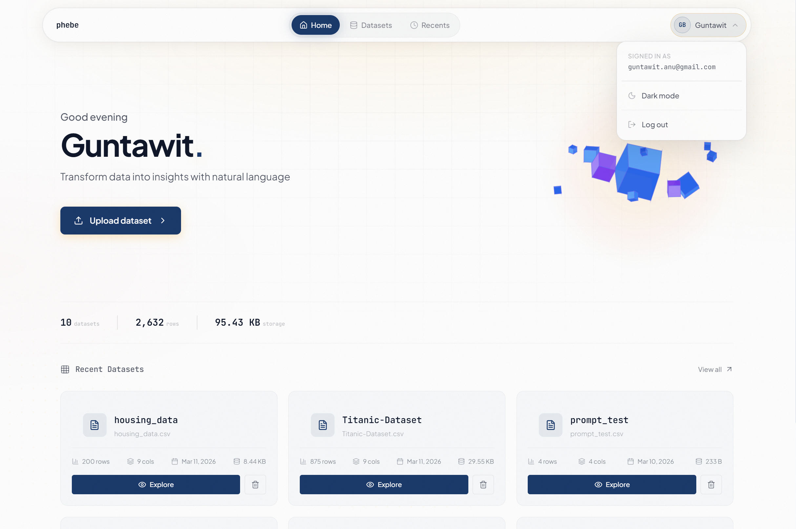
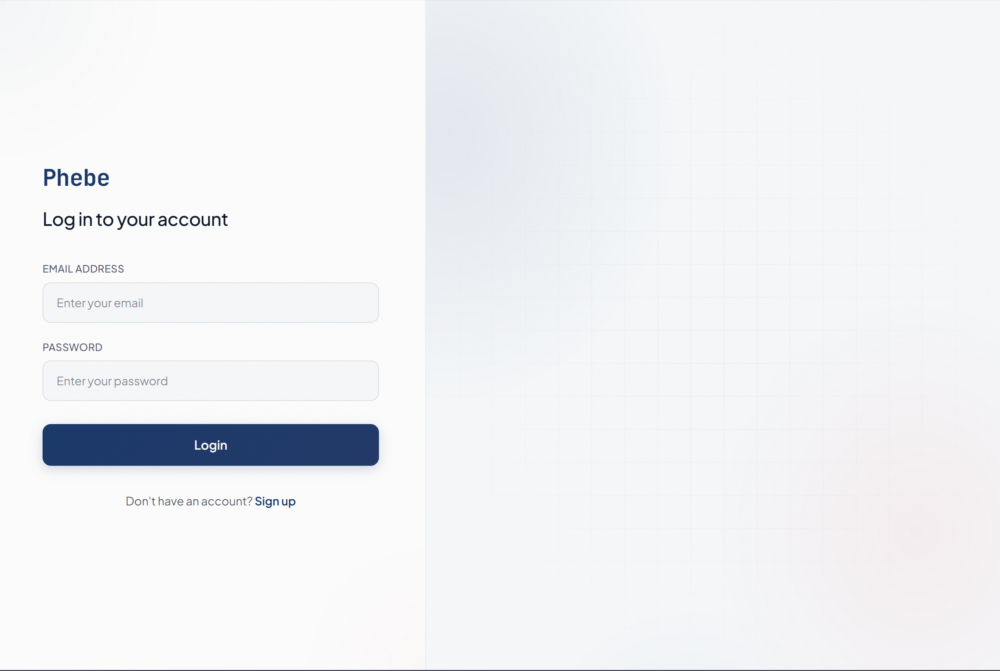
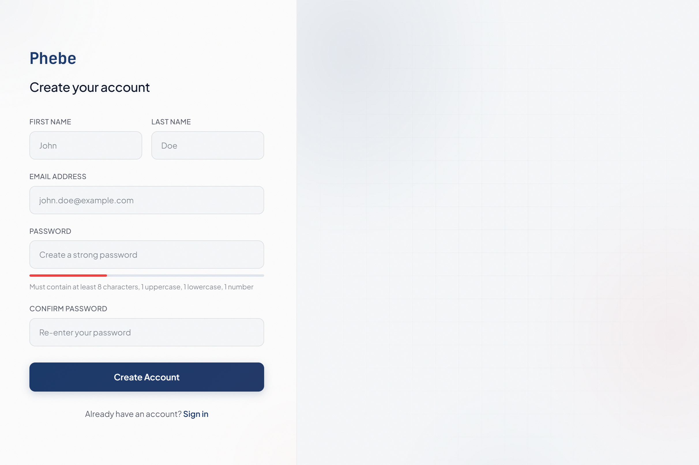
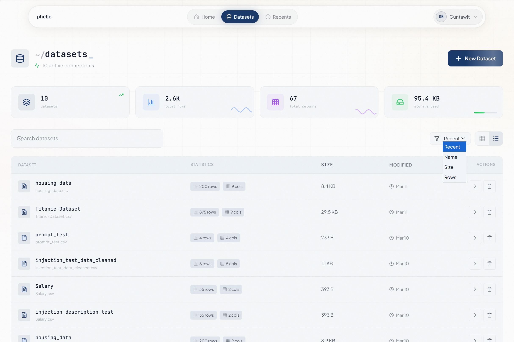
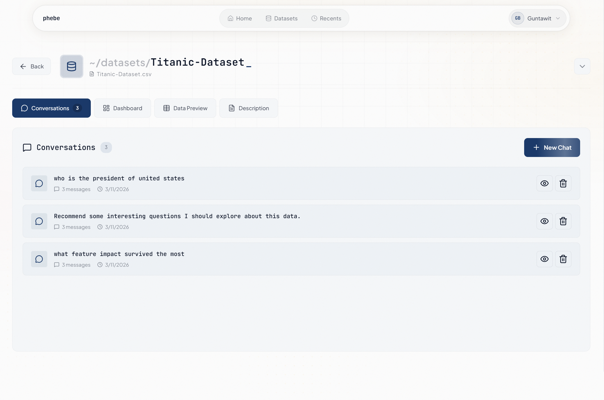
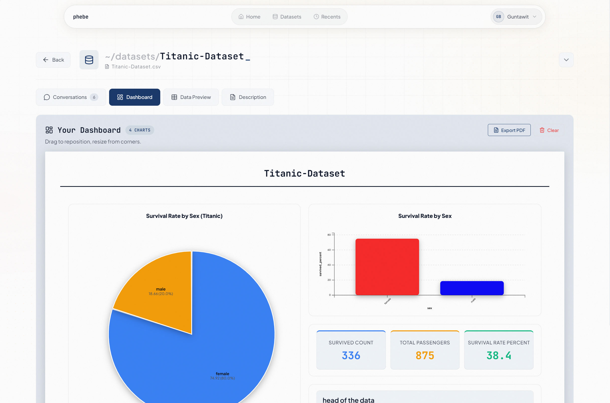
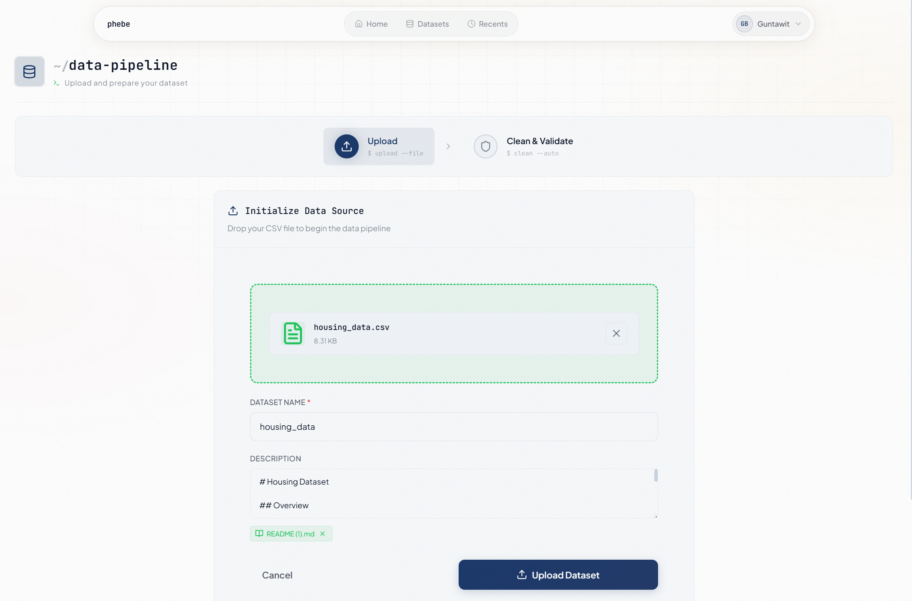
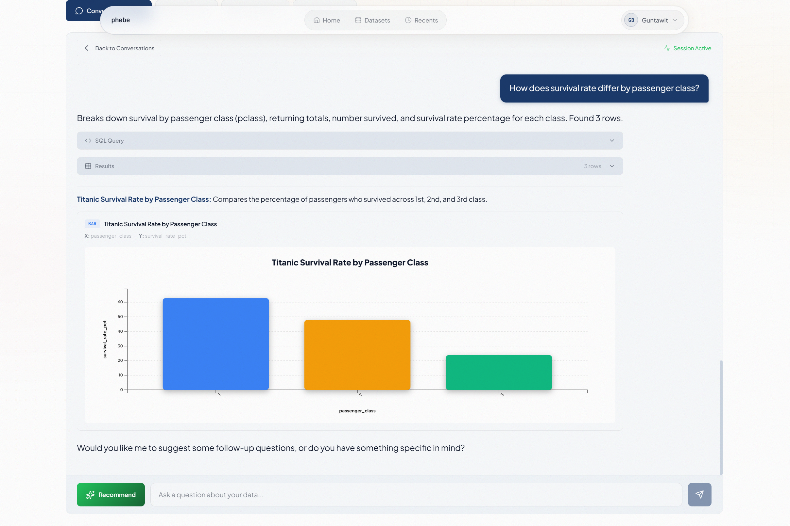
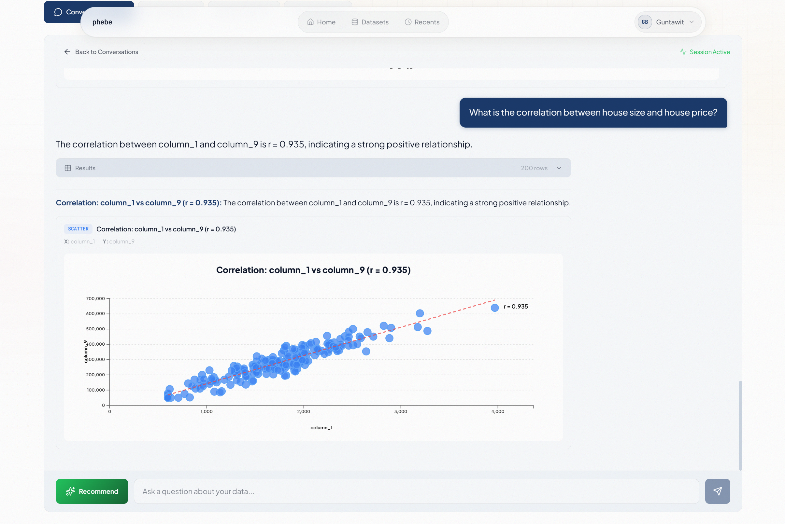
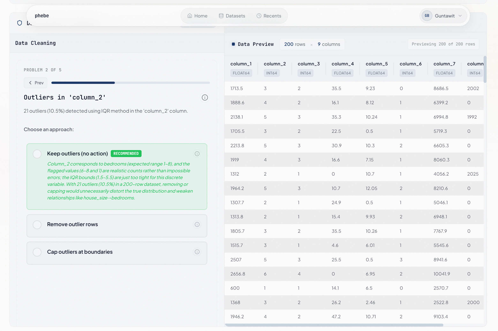

# Phebe

A full-stack application that lets users explore datasets through natural language. Upload a CSV, ask questions in plain English, and get back SQL-powered answers rendered as interactive charts: no query writing required.

Phebe also includes an interactive data cleaning agent that detects quality issues in your data and walks you through fixing them before analysis.

## Features

- **Natural Language Querying**: Ask questions about your data in English. An OpenAI-powered agent translates them into SQL, executes the query, and returns results with a recommended visualization.
- **Interactive Data Cleaning**: An AI agent scans uploaded datasets for problems (missing values, inconsistent types, outliers, duplicates, invalid formats) and suggests fixes you can apply, preview, or undo.
- **CSV Upload with Validation**: Upload CSV files with automatic encoding detection, header preview, and a two-stage confirmation workflow before data is committed.
- **Dashboard & Visualizations**: Save charts to a per-dataset dashboard built on React Grid Layout. Supports bar, line, pie, scatter, area, and histogram charts rendered with D3.js.
- **Conversation History**: Every query session is stored so you can revisit past questions, resume conversations, and track how your analysis evolved.
- **PDF Export**: Export charts and query results to PDF directly from the browser.
- **Authentication**: Google OAuth and email/password login via Firebase.

## Screenshots

### Home Page



### Login Page



### Register Page



### Datasets Page



### Dataset Details



### Dashboard



### Uploading a Dataset



### Conversation Page



### Correlation Analysis



### Data Cleaning



## Tech Stack

### Frontend

- React 19 with Vite 7
- Tailwind CSS 4 (glassmorphism-styled UI)
- D3.js for chart rendering
- TanStack React Table for data grids
- React Grid Layout for dashboards
- Firebase SDK for authentication
- jsPDF + html2canvas for PDF export

### Backend

- FastAPI running on Uvicorn
- SQLAlchemy 2.0 ORM with PyMySQL driver
- OpenAI API (GPT-4o-mini by default) for text-to-SQL and cleaning recommendations
- Pandas / NumPy / SciPy / scikit-learn for data processing
- Guardrails AI for prompt injection detection
- Firebase Admin SDK for token verification

### Database

- MySQL 8.0 for user data, datasets, conversations, and query history
- Firebase Firestore for authentication profiles

### Infrastructure

- Docker and Docker Compose for local development and production
- DigitalOcean App Platform for cloud deployment

## Project Structure

```text
NaturalLanguageforDataVisualization/
├── backend/
│   ├── main.py                    # App initialization and route mounting
│   ├── requirements.txt
│   ├── Dockerfile
│   ├── Auth/                      # Google OAuth, email login, Firebase integration
│   ├── routes/
│   │   ├── datasets.py            # Dataset CRUD, SQL query execution, dashboards
│   │   ├── text_to_sql.py         # Chat sessions for natural language queries
│   │   ├── cleaning.py            # Data cleaning agent endpoints
│   │   ├── metadata.py            # Column stats and dataset metadata
│   │   └── ownership.py           # Access control and resource tracking
│   ├── Agents/
│   │   ├── text_to_sql_agent/     # NL-to-SQL conversion with validation
│   │   ├── cleaning_agent/        # Data quality detection and operations
│   │   ├── analysis_agent/        # Data analysis capabilities
│   │   └── chart_rec_agent/       # Chart type recommendations
│   ├── database/
│   │   ├── db_init.py             # Connection setup
│   │   ├── db_utils.py            # Query helpers
│   │   └── schema.sql             # Table definitions
│   ├── safety/                    # Prompt injection detection
│   └── utils/                     # CSV validation, metadata extraction
├── frontend/
│   ├── src/
│   │   ├── App.jsx                # Routing and layout
│   │   ├── contexts/              # Auth, theme, DB health, navigation guards
│   │   ├── pages/
│   │   │   ├── Home.jsx           # Dashboard
│   │   │   ├── Datasets.jsx       # Dataset list
│   │   │   ├── DatasetDetails.jsx # Query interface and visualizations
│   │   │   ├── DataCleaning.jsx   # Cleaning workflow
│   │   │   ├── DatabaseError.jsx  # DB connection error page
│   │   │   └── History.jsx        # Past conversations
│   │   └── components/            # CSVUpload, ChartRenderer, DataTable, etc.
│   ├── package.json
│   ├── vite.config.js
│   ├── tailwind.config.js
│   ├── Dockerfile
│   └── Dockerfile.dev
├── docker-compose.yml
├── docker-compose.override.yml    # Dev overrides (hot reload, volume mounts)
└── .env.example
```

## Getting Started

### Prerequisites

- Docker and Docker Compose (recommended), or:
- Node.js 22+, Python 3.11+, and MySQL 8.0 for manual setup

### Quick Start with Docker

```bash
# Copy the example environment file and fill in your credentials
cp .env.example .env

# Start all services
docker-compose up -d
```

The frontend will be available at `http://localhost:5173`, the backend at `http://localhost:8000`, and the interactive API docs at `http://localhost:8000/docs`.

### Manual Setup

**Backend:**

```bash
cd backend
python -m venv venv
source venv/bin/activate    # Windows: venv\Scripts\activate
pip install -r requirements.txt
uvicorn main:app --reload
```

**Frontend:**

```bash
cd frontend
npm install
npm run dev
```

### Environment Variables

Create a `.env` file in the project root (see `.env.example` for the full list). The key variables are:

| Variable | Description |
| --- | --- |
| `OPENAI_API_KEY` | OpenAI API key for text-to-SQL and cleaning agents |
| `OPENAI_MODEL` | Model to use (default: `gpt-4o-mini`) |
| `GOOGLE_CLIENT_ID` | Google OAuth client ID |
| `GOOGLE_CLIENT_SECRET` | Google OAuth client secret |
| `FIREBASE_CREDENTIALS_PATH` | Path to Firebase service account JSON |
| `MYSQL_HOST` | Database host (`localhost` or `mysql` in Docker) |
| `MYSQL_PORT` | Database port (default: `3306`) |
| `MYSQL_USER` | Database user |
| `MYSQL_PASSWORD` | Database password |
| `MYSQL_DATABASE` | Database name |
| `FRONTEND_URL` | Frontend origin for CORS (default: `http://localhost:5173`) |
| `VITE_API_BASE_URL` | Backend URL for the frontend (default: `http://localhost:8000`) |
| `VITE_FIREBASE_API_KEY` | Firebase API key for frontend auth |
| `VITE_FIREBASE_PROJECT_ID` | Firebase project ID |

## API Overview

All protected endpoints require a valid session token obtained through the auth flow.

- **Authentication** (`/auth`): Google OAuth login, email/password login, session management.

- **Datasets** (`/datasets`): Upload CSVs, list and delete datasets, execute SQL queries against uploaded data, manage saved dashboard visualizations.

- **Text-to-SQL Agent** (`/agents/text-to-sql`): Start chat sessions tied to a dataset, send natural language questions, get SQL + results + chart recommendations, browse and resume conversation history.

- **Data Cleaning Agent** (`/agents/cleaning`): Start cleaning sessions, receive AI-generated recommendations, apply or undo operations, inspect session state.

- **Metadata** (`/metadata`): Retrieve dataset-level and column-level statistics.

- **Ownership** (`/ownership`): View resource counts, activity logs, storage usage, and transfer dataset ownership.

Full interactive documentation is available at `/docs` when the backend is running.

## How It Works

1. **Upload**: A user uploads a CSV file. The backend validates it, detects encoding and headers, and creates a dedicated MySQL table (`user_data_{dataset_id}`) to hold the data.

2. **Ask**: The user types a question like "What were the top 5 products by revenue last quarter?" The text-to-SQL agent sends the dataset schema to OpenAI, receives a generated SQL query, validates it for safety (complexity limits, forbidden operations, injection checks), and executes it.

3. **Visualize**: The agent recommends a chart type based on the query results. The frontend renders the chart with D3.js. Users can save charts to a persistent dashboard.

4. **Clean**: Before or after querying, users can run the cleaning agent. It scans the dataset for quality issues and suggests operations like filling missing values, removing duplicates, or standardizing formats. Each operation can be previewed and undone.

## Available Scripts

### Frontend

| Command | Description |
| --- | --- |
| `npm run dev` | Start development server with hot reload |
| `npm run build` | Build for production |
| `npm run preview` | Preview production build locally |
| `npm run lint` | Run ESLint |
